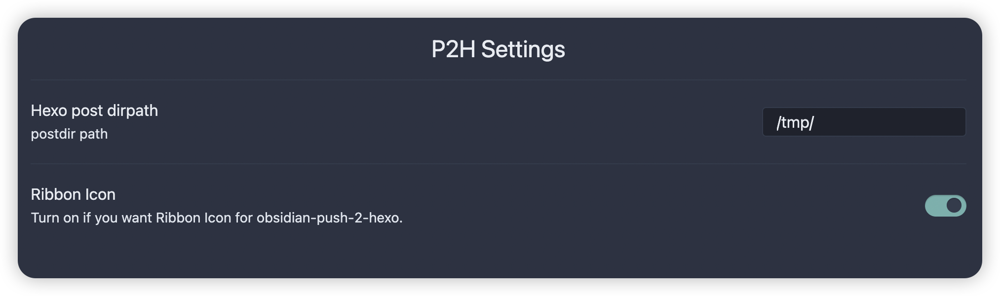

## Description

This plugin supports only mac platform (Maybe with a little modification it will work on other platforms).

It is used to convert note to hexo supported format and package to directory.

## Who uses it?

**This is very useful if you use Obsidian for your hexo blog**

Try it out and have fun.

## Demo

## MIT license
